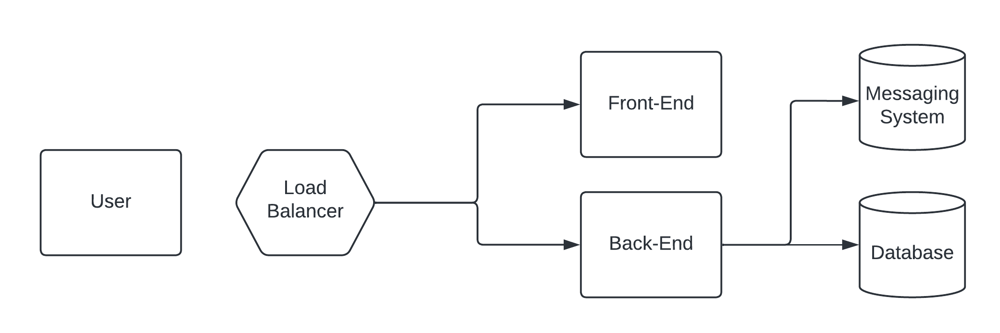
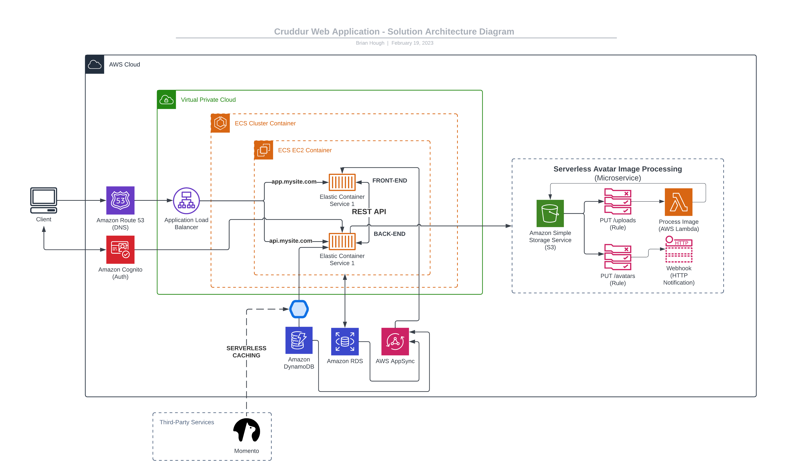

# Week 0

This week, I did the following:
-   Watched Week 0 - [Live Streamed Video](https://www.youtube.com/watch?v=SG8blanhAOg&list=PLBfufR7vyJJ7k25byhRXJldB5AiwgNnWv&index=12)
-   Watched Chirag's Week 0 - [Spend Considerations](https://www.youtube.com/watch?v=OVw3RrlP-sI&list=PLBfufR7vyJJ7k25byhRXJldB5AiwgNnWv&index=13)
-   Watched Ashish's Week 0 - [Security Considerations](https://www.youtube.com/watch?v=4EMWBYVggQI&list=PLBfufR7vyJJ7k25byhRXJldB5AiwgNnWv&index=15)
-   Recreate Conceptual Diagram in Lucid Charts or on a Napkin - [Tutorial](https://www.youtube.com/watch?v=K6FDrI_tz0k&list=PLBfufR7vyJJ7k25byhRXJldB5AiwgNnWv&index=17)
    - This was a great element of the week because I usually have been making solution architecture diagrams in Keynote/Google Slides. 
    - Having a [framework to build from an AWS template](../journal-media/week0/how-to-add-aws-icons-template-lucid-chart.png) each time is a game changer.
-   Recreate Logical Architectual Diagram in Lucid Charts
-   Created an Admin User
-   Used CloudShell
-   Generated AWS Credentials
-   Installed AWS CLI
-   Created a Billing Alarm
-   Created a Budget 
    - I created 2 budgets: (>$1 montly and a monthly) - and these are great ways to measure against different price-points or per build/deployment

## Conceptual Diagram
* Designed to be more of a high-level walk through of the Cruddur cloud system.

## Logical Architecture Diagram
- Designed as a fully mapped out AWS solution architecture diagram of the Cruddur cloud system.
- Included a mini-map of the serverless image processing microservice.

