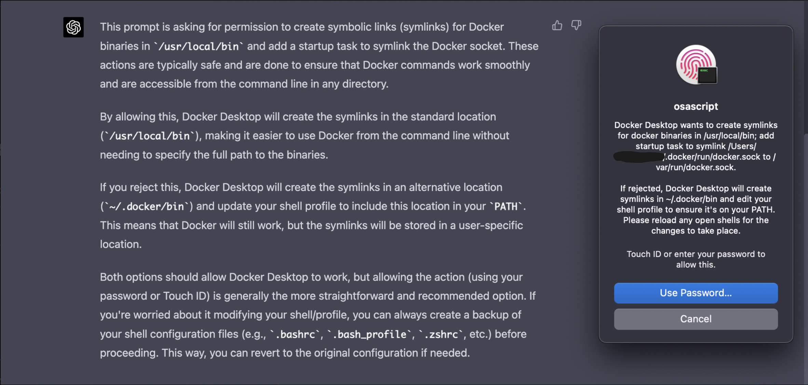
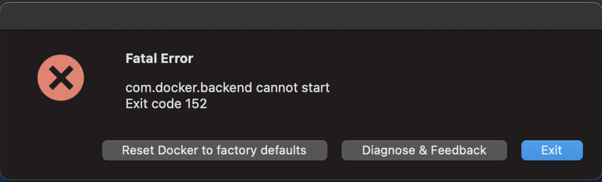

# Week1: App Containerization

This week, I did the following:
- Learned how to set up Docker Hub on a M1 Mac. This took a not insignificant amount of time to figure out. But hey, if you're not breaking software, are you really coding? Here is how I unblocked myself:
    - Went to the Apple install section of Docker: [Docker Desktop for Mac with Apple silicon](https://docs.docker.com/desktop/install/mac-install/)
        - Note: Do not click the one that says `Intel chip`
    - Looked up on GitHub and asked ChatGPT about the Docker permission setting around creating symbolic links (`symlinks`) - this was another blocker. 
        - Found out that we need to enable a safe way for Docker to run in our account, instead of messing with the SHELL/PATH to save things in an unusual way.
        - Outcome: 
        - 
    - Upon installing and then running Docker Desktop, if you get `❌ Fatal Error: com.docker.backend cannot start Exit Code 152`, go to your Activity Monitor and find `com.docker.backend` and force quit this process. Then Close the pop-up. Re-open Docker Desktop and wait for it to start/load.
        - This is what the error looks like:
        - 
        - After removing the process from Activity Monitor, we can run Docker Desktop by re-starting the application:
        - 

